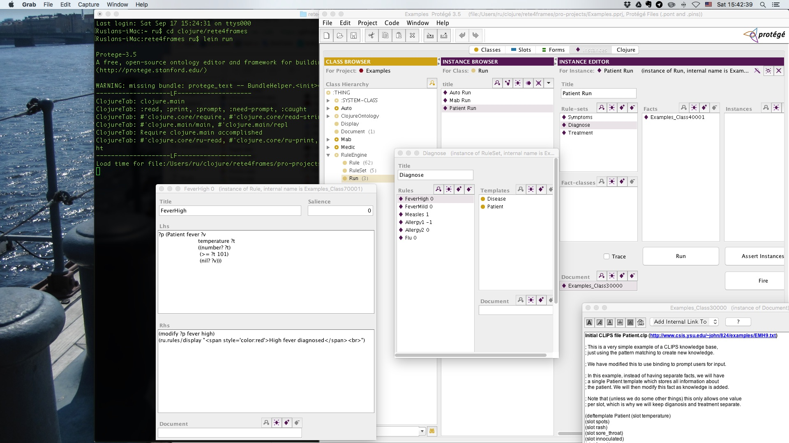
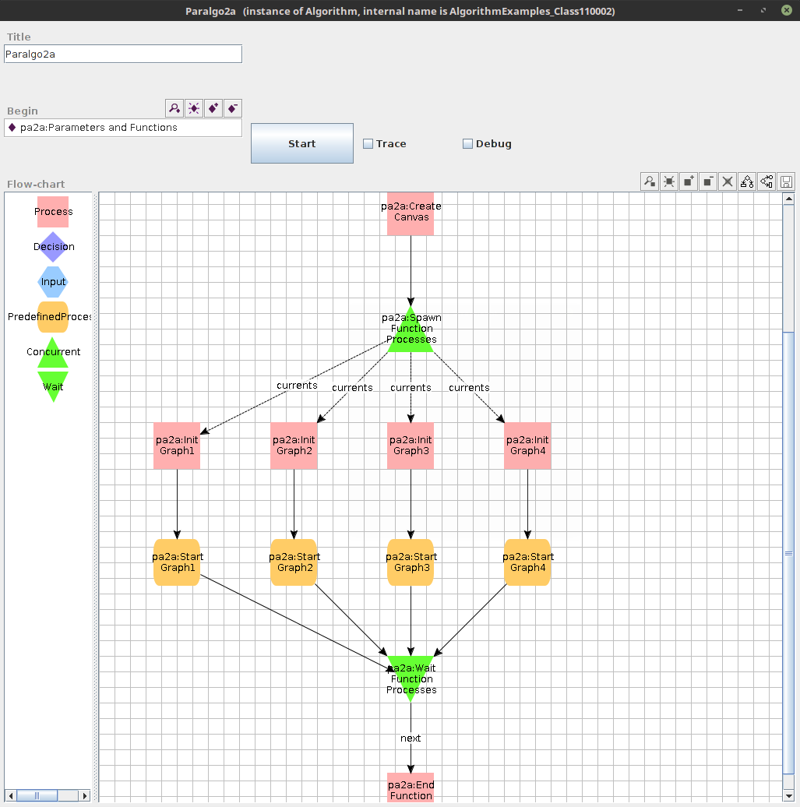

# r4f-pro

Integrated Development Environment for [rete4frames](https://github.com/rururu/rete4frames) rule engine and expert system shell based on [Protege-3.5 ontology editor](http://protege.stanford.edu) supplemented with visual creation of algorithms. It combines two well-known paradigms of software development: algorithms for strictly defined processes and rules for fuzzy, fragmentarily defined processes and phenomenons.



## Usage

Simple start:
```clj
$ cd <..>/r4f-pro
$ lein run
```
Start IDE for developers
```clj
$ cd <..>/r4f-pro
$ lein repl
...
rete.protege=> (-main)
```
## Expert System Shell

This IDE gives possibility to
  * visually create rules for the simple CLIPS-like expert system shell on Clojure [rete4frames](https://github.com/rururu/rete4frames) and
  * process the ontology-based object-oriented knowledge created visually in the Protege environment.

To create your own expert system you need to include RuleEngine.pprj project into your Protege project using a menu item "Project -> Manage Included Projects..".
Then you have to create an instance of a class  "Run" and fill its slot "rule-sets" with previously created instances of the class "RuleSet". Respectively these instances must be filled with rules, i.e. instances of the class "Rule". Also, you have to fill the slot "facts" of the "Run" instance with instances of some class. These will be initial facts of a given session of your expert system. That's all. Start your expert system to work with a "Run" button.

See details in Examples.pprj project.

3 minute IDE [screencast1](https://www.youtube.com/watch?v=RZKKq6Pym44&feature=youtu.be).

## Algorithms

In a project Algorithm.pprj collected functionality for visual creation of algorithms. Algorithms are created using drag-and-drop of standard blocks from a palette on a canvas of a flow-chart and following connection them by stream lines. After that the standard blocks are filled with clojure code as of "let" macro body.

Important distinction of these algorithms from a common notion of algorithm in that they can represent **parallel processes**. For this purpose to standard blocks added two new ones: "Concurrent" and "Wait". Full list of blocks is following:

  * Input
  * Process
  * Decision
  * Predefined processes
  * Concurrent
  * Wait

If you want to add this functionality to your own project you need to include Algorithm.pprj project into it. This can be done by "Project -> Manage Included Projects.." menu item.

Algorithm examples in AlgorithmExamples.pprj project.

Creation of a simplest algorithm [screencast2](https://youtu.be/oRCMw_rnLvg) (7 min).

Creation of a more complex parallel algorithm [screencast3](https://youtu.be/exca_ac2bj4) (29 min).



## License

Copyright © 2016 Ruslan Sorokin.

Distributed under the Eclipse Public License either version 1.0 or (at
your option) any later version.
[License of Protege-3.5](https://github.com/rururu/r4f-pro/blob/master/LICENSE_PROTEGE)
